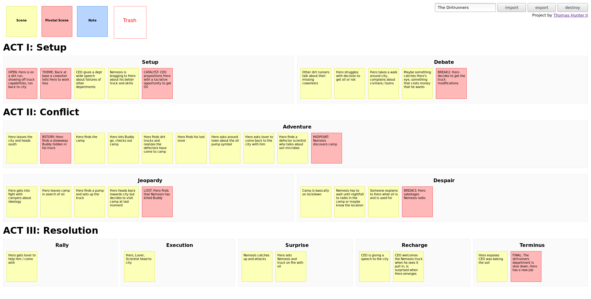

# Plot Designer

Try the [Plot Designer](https://thomashunter.name/plot-designer/) online. This is a simple drag and drop browser UI for designing story plots. Project _only_ works on desktop for now.

This project does not require a web server to function. Stories will be saved in Local Storage. They can also be exported to and imported from a file on disk.

## TODO

- Fix trash silliness / rendering
- Render to text file (markdown—for non programmers)
- Simplify output format?
  - Could be represented as _just_ `.cards`, `.zones` is redundant
- Support for multiple stories?
- Refactor
  - Switch to a UI framework
  - Dragula shouldn't clone element, asymmetry when import vs drop

